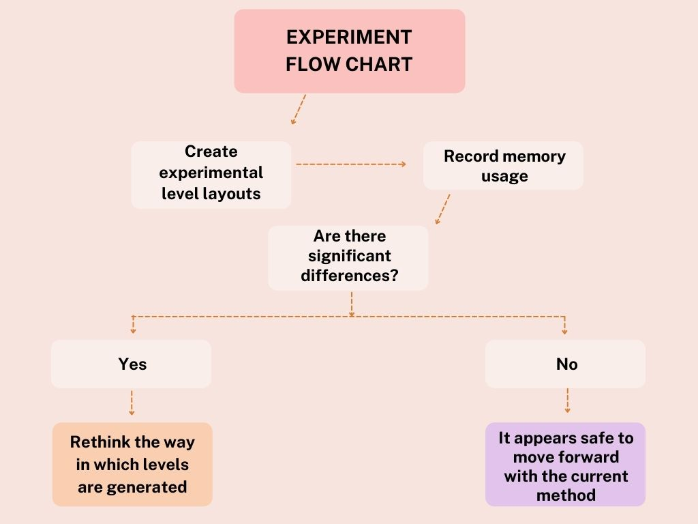
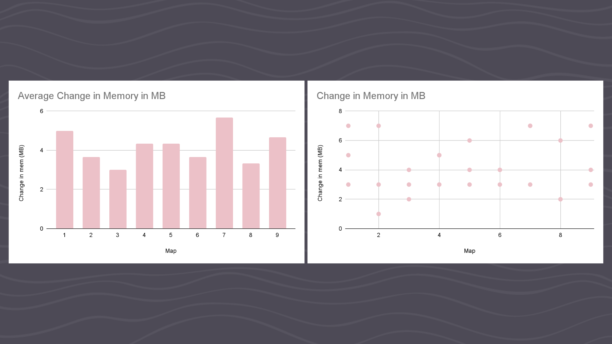
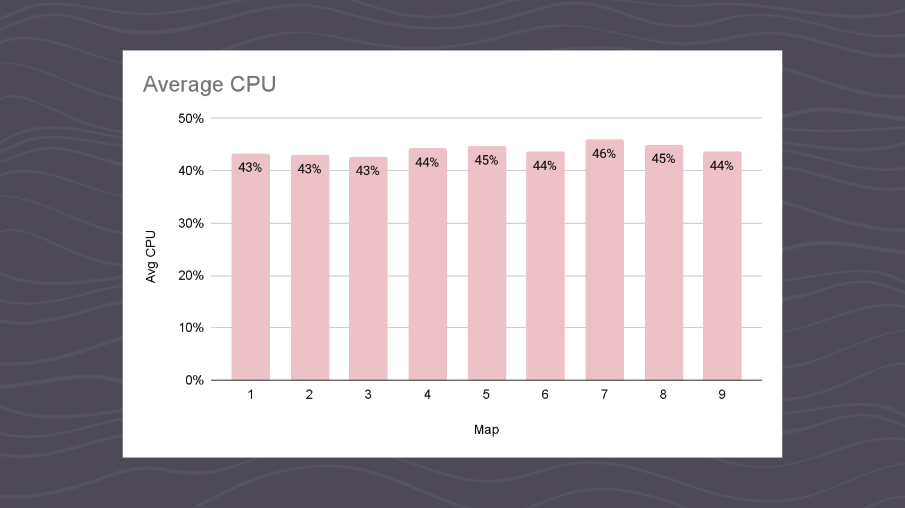

### Let's experiment with my prototype!

**The research question for this experiment was:**

Does the amount of game objects that are generated significantly impact the memory usage of my game?

**What data will my experiment produce?**

The findings will be be measurements of memory usage when the game is running. If there are significant differences, then the answer to my question will essentially be 'yes.' Alternatively, if there is not major differences, then the answer is 'no.'

Depending on the answer I get from these findings, the way in which my game generates the level may need to change. If having too many game objects becomes and issue, then I will need to minimize the amount of game objects that are produced.

**The detailed steps of my experiment:**

 1. Create varying game level layouts. Layouts will likely differ in size and or having a floor or not.
 2. Run the game with each of these layouts, recording the memory usage each time.
 3. Analyze the results. Were the results conclusive?
 4. Act on the findings. If memory usage is an issue, the method of level generation will need to be rethought.

 

**The execution of my experiment:**

To execute my experiment, I created 9 maps to run:

exp-1: singular room, no floor (1 room)
exp-2: more medium-sized, no floor (5 rooms)
exp-3: exp-2 but with floor (5 rooms)
exp-4: large map, no floor (10 rooms)
exp-5: exp-4 but with floor (10 rooms)
exp-6: very large map, no floor (20 rooms)
exp-7: exp-6 but with floor (20 rooms)
exp-8: huge map, no floor (36 rooms)
exp-9: exp-8 but with floor (36 rooms)

The idea behind making the maps in this way was to determine if the amount of game object significantly impacts memory usage. I am also hoping to see whether maps that are the same with one having floor and the other not will produce very different results.

I ran the game within the Unity Editor 3 times for each map and recorded the memory and CPU at its peak each time.
A challenge I encountered was that the memory usage at rest was different each time. To overcome this, I recorded the memory before and during running the game in order to calculate the change in memory that occurred. I wrote my results in a spreadsheet as I recorded them.

**Analyzing the results:**

The results of this experiment are too inconsistent for me to comfortably make a definite conclusion. There are no clear, consistent patterns in the change in memory when the experiments were run. Additionally, there is very little change in peak CPU. There is a slight trend suggesting that peak CPU is higher for larger, more complex maps.

Based on these current results, I hypothesize that more game objects *does* mean more memory usage. Additionally, I may propose that with simple game objects the change is not hugely significant.

